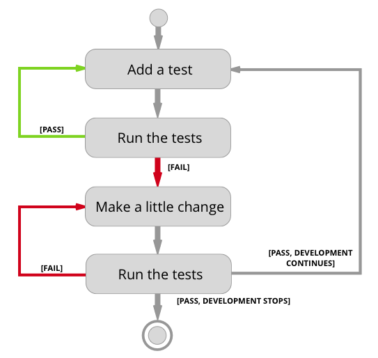

#HSLIDE

#TDD
 
##An Introduction
	If it's worth building, it's worth testing. 
	
	If it's not worth testing, why are you wasting your 
	time working on it?

	- Scott Ambler 

#####Matt Knights
	
#HSLIDE

##What is TDD

**T**est **D**riven **D**esign is a software design method beyond a method of testing. Based on very short development iterations, requirements are defined as a series of test cases for which code is written to pass the new tests, only

#HSLIDE

##Why Use it?

*	write code to meet the acceptance criteria and just make test pass rather than build beyond the horizon
*	promotes loosely coupled components
*	provides a textual description of the facets of the application
*	helps find errors early

#HSLIDE

##How its done

######Original - Scott W. Ambler

#HSLIDE

##Don't take this as gospel

###Read it

[Introduction to TDD - Scott W Ambler](http://www.agiledata.org/essays/tdd.html)

[How Does TDD Affect Design - James Shore](http://www.jamesshore.com/Blog/How-Does-TDD-Affect-Design.html)

###Watch it

[TDD: Where Did It All Go Wrong? - Ian Cooper](https://www.infoq.com/presentations/tdd-original) ...great video with a more practical view

